# Locnative.com — Architecture Audit & Visual System Map

> **Date:** 2026-06-25 · **Method:** Traced from source — `wrangler.jsonc`/`wrangler.toml`, Drizzle schema, oRPC routers, BetterAuth config, env schemas, and Worker entry points. Where something could not be verified from the repo it is **explicitly flagged** rather than assumed.
>
> **Deliverables:** Editable diagrams in [`drawio/`](./drawio) · rendered [`png/`](./png) · [`svg/`](./svg). Mermaid sources are embedded inline below so each diagram renders directly in GitHub/IDE.

## What the platform actually is

Locnative.com is a **location-API platform** (Radar-style: geocoding, reverse/nearby, autocomplete, zones/geofencing, device tracking, routing/isochrones, batch geocoding, webhooks) built on a **pnpm + Turbo monorepo** deployed entirely on **Cloudflare Workers**, with **Neon Postgres + PostGIS** as the system of record (~129M address rows) and **BetterAuth** (self-hosted) for identity. Billing is **usage-metered through Stripe**. There is **no CI/CD** — deploys are manual `wrangler deploy`.

Three deployed Workers:

| Worker | Domain | Role |
|---|---|---|
| `locnative-web` | `locnative.com` | TanStack Start SSR app + static client assets |
| `locnative-server` | `api.locnative.com` | Hono + oRPC API, queue consumer, cron, `UsageMeter` DO |
| `locnative-mcp` | `mcp.locnative.com` | Model Context Protocol server (`LocnativeMcp` DO) |

`locnative-web` reaches the API through a **service binding** (`SERVER`), avoiding a public round-trip for SSR session checks.

---

## 1. High-Level System Overview

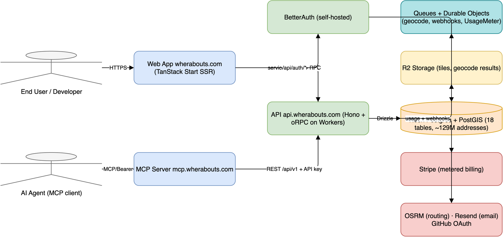

```mermaid
flowchart LR
  user([End User / Developer]):::u --> web[Web App<br/>locnative.com<br/>TanStack Start SSR]:::fe
  agent([AI Agent / MCP client]):::u --> mcp[MCP Server<br/>mcp.locnative.com]:::fe
  web -->|service binding + RPC| api[API · api.locnative.com<br/>Hono + oRPC on Workers]:::be
  mcp -->|REST /api/v1 + API key| api
  web -->|/api/auth/*| auth[BetterAuth]:::be
  api -.-> auth
  api --> q[Queues + Durable Objects<br/>geocode · webhooks · UsageMeter]:::q
  api --> r2[(R2 Storage<br/>tiles · geocode results)]:::st
  api -->|Drizzle| pg[(Neon Postgres + PostGIS<br/>~129M addresses)]:::db
  auth --> pg
  api -->|usage + webhooks| stripe[Stripe]:::ext
  api --> ext[OSRM · Resend · GitHub OAuth]:::ext
  classDef u fill:#F5F5F5,stroke:#666; classDef fe fill:#DAE8FC,stroke:#6C8EBF; classDef be fill:#D5E8D4,stroke:#82B366; classDef db fill:#FFE6CC,stroke:#D79B00; classDef ext fill:#F8CECC,stroke:#B85450; classDef q fill:#B0E3E6,stroke:#0E8088; classDef st fill:#FFF2CC,stroke:#D6B656;
```

**Observations:** Clean three-surface split (human web, machine MCP, REST API) all converging on one API package. Edge-first; no traditional servers. **Risks:** Neon and OSRM are external single points of failure (see #10). **Priority: LOW** (overview).

---

## 2. Detailed Application Architecture

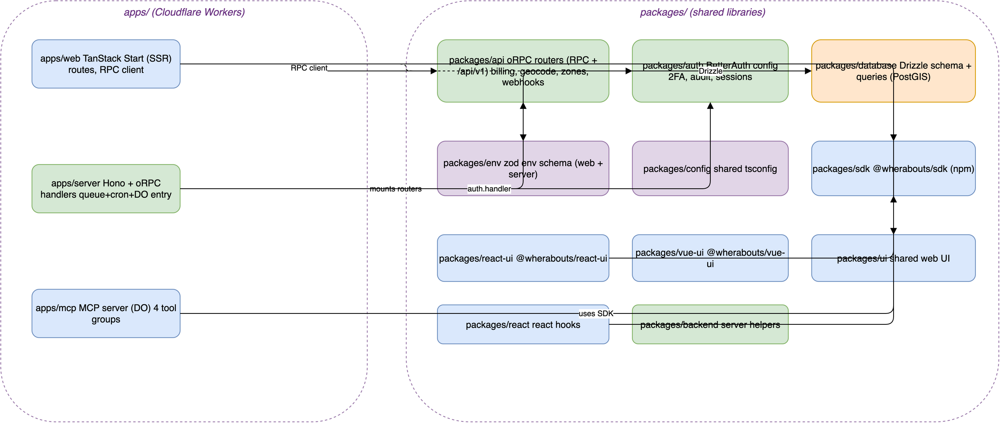

```mermaid
flowchart TB
  subgraph apps[apps/ — Workers]
    web[apps/web<br/>TanStack Start SSR]:::fe
    server[apps/server<br/>Hono + oRPC, queue/cron/DO entry]:::be
    mcpapp[apps/mcp<br/>MCP server DO]:::fe
  end
  subgraph pkgs[packages/ — shared]
    api[packages/api<br/>oRPC routers · billing · geocode · zones · webhooks]:::be
    auth[packages/auth<br/>BetterAuth · 2FA · audit]:::be
    database[packages/database<br/>Drizzle + PostGIS]:::db
    env[packages/env<br/>zod env]:::in
    sdk[packages/sdk<br/>@locnative/sdk npm]:::fe
    reactui[react-ui]:::fe
    vueui[vue-ui]:::fe
    ui[ui]:::fe
  end
  web -->|RPC client| api
  web -.-> auth
  web --> ui & sdk
  server -->|mounts routers| api
  server -->|auth.handler| auth
  mcpapp -->|uses| sdk
  api -->|Drizzle| database
  api --> env
  auth --> database & env
  reactui --> sdk
  vueui --> sdk
  classDef fe fill:#DAE8FC,stroke:#6C8EBF; classDef be fill:#D5E8D4,stroke:#82B366; classDef db fill:#FFE6CC,stroke:#D79B00; classDef in fill:#E1D5E7,stroke:#9673A6;
```

**Observations:** `packages/api` is the **architectural hub** — every app and most packages depend on it. Good: business logic lives in one testable package; apps are thin adapters (Worker entry, SSR, MCP). 13 packages incl. publishable SDK + React/Vue UI libs. **Risks:** the api package is a god-module risk (billing, geocoding, zones, webhooks, routing all co-located) — changes have wide blast radius. **Recommendation:** consider splitting `packages/api` into `api-core` (context/builder/middleware) + domain packages as it grows. **Priority: MEDIUM**.

---

## 3. Infrastructure

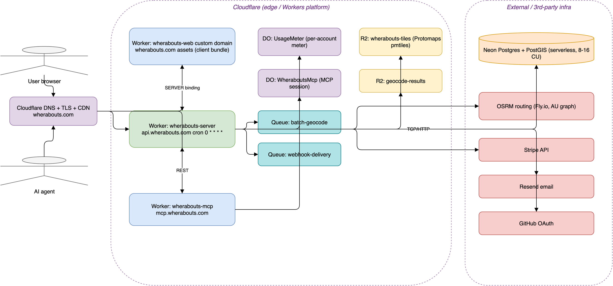

```mermaid
flowchart LR
  user([User]):::u --> dns
  agent([Agent]):::u --> dns[Cloudflare DNS + TLS + CDN]:::in
  subgraph CF[Cloudflare Workers platform]
    webw[locnative-web<br/>+ client assets]:::fe
    apiw[locnative-server<br/>cron 0 * * * *]:::be
    mcpw[locnative-mcp]:::fe
    do1[DO UsageMeter]:::in
    do2[DO LocnativeMcp]:::in
    q1[[Queue batch-geocode]]:::q
    q2[[Queue webhook-delivery]]:::q
    r2t[(R2 tiles)]:::st
    r2g[(R2 geocode-results)]:::st
  end
  dns --> webw & apiw & mcpw
  webw -->|SERVER binding| apiw
  mcpw -->|REST| apiw
  apiw --> do1 & q1 & q2 & r2t & r2g
  mcpw --> do2
  apiw -->|TCP/HTTP| neon[(Neon Postgres + PostGIS)]:::ext
  apiw --> osrm[OSRM on Fly.io]:::ext
  apiw --> stripe[Stripe]:::ext
  apiw --> resend[Resend]:::ext
  apiw --> gh[GitHub OAuth]:::ext
  classDef u fill:#F5F5F5,stroke:#666; classDef fe fill:#DAE8FC,stroke:#6C8EBF; classDef be fill:#D5E8D4,stroke:#82B366; classDef in fill:#E1D5E7,stroke:#9673A6; classDef q fill:#B0E3E6,stroke:#0E8088; classDef st fill:#FFF2CC,stroke:#D6B656; classDef ext fill:#F8CECC,stroke:#B85450;
```

**Observations:** Fully serverless edge. `MAP_TILES` R2 bucket is `remote: true` (read-through from prod in dev). Cron `0 * * * *` drives hourly Stripe usage reporting. **Risks / flagged unknowns:** (1) **OSRM host is not in the repo** — config is `OSRM_BASE_URL`+token; memory indicates a single Fly.io machine with the AU graph only → routing is **AU-only and a SPOF**. (2) Neon region/replica topology not in repo — assume single primary. (3) No WAF/rate-limit rules at the edge are declared in wrangler config (BetterAuth has app-level rate limiting only). **Recommendations:** add Cloudflare WAF/rate-limiting rules for `/api/v1/*`; document OSRM HA; consider Neon read replica for PostGIS-heavy reads. **Priority: HIGH**.

---

## 4. API Architecture

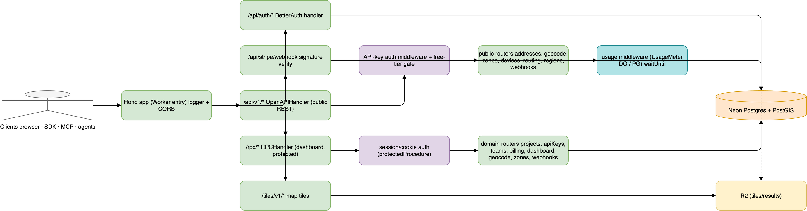

```mermaid
flowchart LR
  client([Clients: browser · SDK · MCP · agents]):::u --> hono[Hono entry<br/>logger + CORS]:::be
  hono --> authh[/api/auth/* BetterAuth/]:::be
  hono --> stripeh[/api/stripe/webhook<br/>sig verify/]:::be
  hono --> openapi[/api/v1/* OpenAPIHandler/]:::be
  hono --> rpc[/rpc/* RPCHandler/]:::be
  hono --> tiles[/tiles/v1/*/]:::be
  openapi --> akmw[API-key auth<br/>+ free-tier gate]:::in
  rpc --> sessmw[session/cookie auth<br/>protectedProcedure]:::in
  akmw --> pubr[public routers<br/>addresses · geocode · zones<br/>devices · routing · regions · webhooks]:::be
  sessmw --> domr[domain routers<br/>projects · apiKeys · teams · billing<br/>dashboard · geocode · zones · webhooks]:::be
  pubr --> usage[usage middleware<br/>UsageMeter DO / PG · waitUntil]:::q
  usage --> db[(Neon + PostGIS)]:::db
  pubr --> db
  domr --> db
  authh --> db
  tiles --> r2[(R2)]:::st
  classDef u fill:#F5F5F5,stroke:#666; classDef be fill:#D5E8D4,stroke:#82B366; classDef in fill:#E1D5E7,stroke:#9673A6; classDef q fill:#B0E3E6,stroke:#0E8088; classDef db fill:#FFE6CC,stroke:#D79B00; classDef st fill:#FFF2CC,stroke:#D6B656;
```

**Request lifecycle:** Hono `logger` → **two CORS policies** (`/api/v1/*` open `origin:*` no-credentials for third-party API; everything else credentialed + origin-allowlisted) → handler dispatch. Public `/api/v1/*` runs through `OpenAPIHandler` (oRPC) with **API-key middleware + synchronous free-tier gate**; usage is metered via the `UsageMeter` DO (exact under concurrency) or a Postgres fallback, written with `ctx.waitUntil` so accounting survives past the response. Errors are normalized through an explicit ORPC→API code map; every response gets `cache-control` + `Server-Timing`.

**Observations:** Mature edge-API design — idempotency-key + SDK headers in the allowlist, no-store on errors, per-endpoint Server-Timing. **Risks:** the `/api/v1/*` REST surface and the `/rpc/*` dashboard surface duplicate domains (geocode/zones/webhooks exist in both `public/` and `domains/`) — risk of drift between them (a prior incident, per project history, was an endpoint silently reverted by a merge with green tests). **Recommendation:** share handler cores between public+domain routers; contract-test the OpenAPI surface. **Priority: MEDIUM**.

---

## 5. Authentication & Security Flow

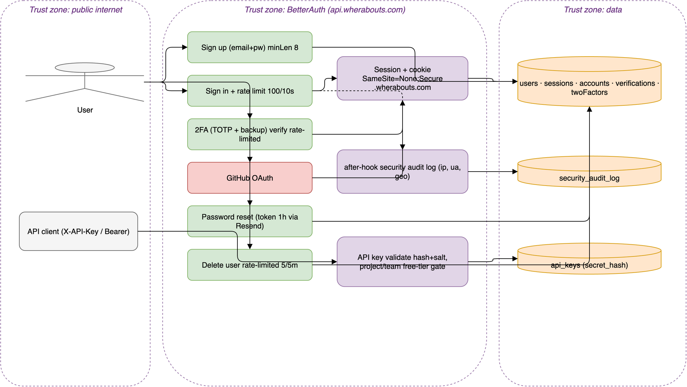

```mermaid
flowchart LR
  user([User]):::u
  apicli([API client<br/>X-API-Key / Bearer]):::u
  user --> signup[Sign up email+pw min8]:::be
  user --> signin[Sign in · rate-limit 100/10s]:::be
  user --> twofa[2FA TOTP + backup<br/>verify rate-limited]:::be
  user --> oauth[GitHub OAuth]:::ext
  user --> reset[Password reset<br/>token 1h via Resend]:::be
  user --> del[Delete user 5/5m]:::be
  signin & oauth & twofa --> session[Session + cookie<br/>SameSite=None;Secure · .locnative.com]:::in
  session --> authtbl[(users · sessions · accounts<br/>verifications · twoFactors)]:::db
  signin -.after-hook.-> audit[security audit log<br/>ip · ua · geo]:::in --> auditbl[(security_audit_log)]:::db
  apicli --> apikey[API key validate<br/>hash+salt · project/team · gate]:::in --> keytbl[(api_keys secret_hash)]:::db
  classDef u fill:#F5F5F5,stroke:#666; classDef be fill:#D5E8D4,stroke:#82B366; classDef ext fill:#F8CECC,stroke:#B85450; classDef in fill:#E1D5E7,stroke:#9673A6; classDef db fill:#FFE6CC,stroke:#D79B00;
```

**Trust zones:** public internet → BetterAuth (`api.locnative.com`) → data. **Strengths:** TOTP 2FA + backup codes with tightened per-route rate limits (verify 10/60s, enable/disable 5/60s, delete-user 5/300s); global rate limit 100/10s; password reset tokens expire in 1h; **API keys stored as hash+salt** with a display suffix only; **constant-time comparison** on the internal-auth path; after-hook **security audit log** capturing IP/UA and CF geo on session create; cross-subdomain cookies correctly `SameSite=None;Secure` in prod and `Lax`/insecure on localhost.

**Risks:** (1) **The internal explorer-test path authenticates with `BETTER_AUTH_SECRET` as a shared bearer** (`x-locnative-internal-auth`) and trusts a caller-supplied `api-key-id` — if that secret leaks, an attacker can act as any API key without the secret. Constant-time compare mitigates timing but the design couples two concerns to one secret. (2) Only GitHub OAuth — no Google/SSO. (3) BetterAuth rate limiting is in-app (per-worker memory unless backed by storage) — **flag:** verify it is durable across edge isolates, otherwise limits are weaker than they look. **Recommendations:** give the explorer-test path its own scoped secret; confirm rate-limit storage backing; add WAF. **Priority: HIGH**.

---

## 6. Database Relationship Diagram (ERD)

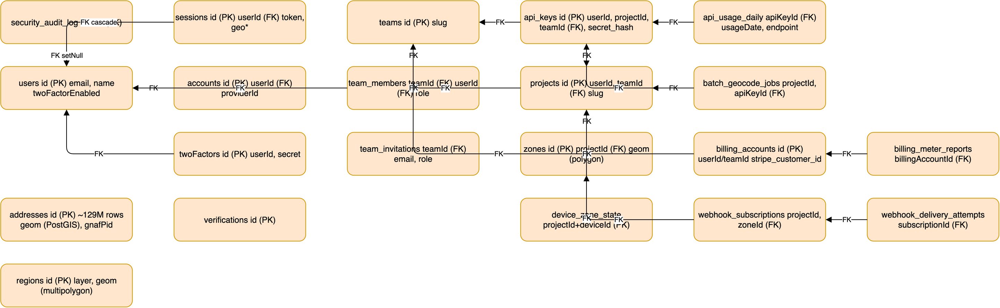

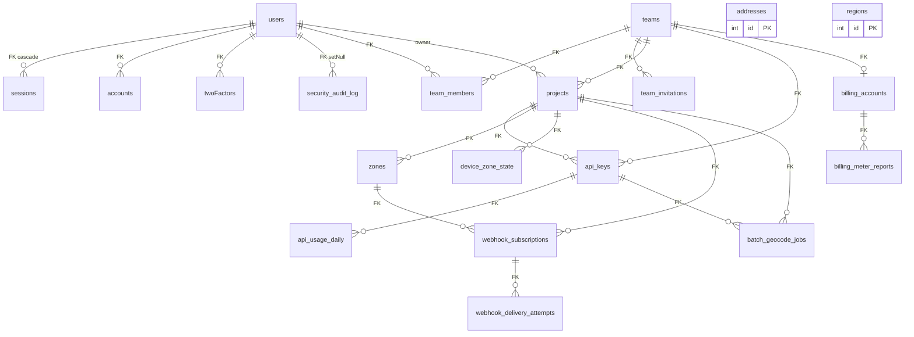

**18 tables.** Auth (`users`,`sessions`,`accounts`,`verifications`,`twoFactors`), tenancy (`teams`,`team_members`,`team_invitations`,`projects`,`api_keys`), billing (`billing_accounts`,`billing_meter_reports`,`api_usage_daily`), geo product (`zones`,`device_zone_state`,`webhook_subscriptions`,`webhook_delivery_attempts`,`batch_geocode_jobs`), reference data (`addresses` ~129M, `regions`), and `security_audit_log`. FKs use `onDelete: cascade` throughout (set-null for audit).

**Index review (from schema):** `addresses` is well-indexed for the access patterns — btree on country/state/postcode/locality/street, plus **two GiST indexes**: `geom` and an **expression index on `geom::geography`** (the documented fix that took nearby/reverse from ~15–48s seq scans to ~130–220ms). `regions` has GiST on `geom` + btree on `layer`. `api_usage_daily` has a unique (key,date,endpoint) + several supporting indexes.

**Observations / opportunities (flagged):**
- **`users.id`/`projects.userId` are `text`, not FK-constrained from `projects`/`api_keys`** — `projects.userId` and `api_keys.userId` are plain `text` with no `references(users.id)`. Orphan rows are possible if a user is deleted; deletion cascade for those tables relies on app logic, not the DB. **MEDIUM.**
- `addresses.searchText` has **no index shown** in the schema despite being central to autocomplete; matching relies on btree LIKE on uppercased columns (per project history). Confirm the prefix index exists in a migration. **MEDIUM — verify.**
- `regions.code` intentionally unindexed (documented). Fine.
- No partitioning on `api_usage_daily` — at high volume the daily table grows unbounded; consider monthly partitioning/retention. **LOW–MEDIUM.**

**Priority: MEDIUM** (mostly referential-integrity hardening + one index verification).

---

## 7. User Journey Maps

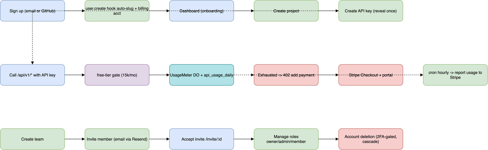

```mermaid
flowchart LR
  subgraph Onboarding
    j1[Sign up email/GitHub]:::fe --> j2[user.create hook<br/>auto-slug + billing acct]:::be --> j3[Dashboard]:::fe --> j4[Create project]:::be --> j5[Create API key reveal-once]:::be
  end
  subgraph Usage_Billing
    k1[Call /api/v1/* w/ key]:::fe --> k2[free-tier gate 15k/mo]:::in --> k3[UsageMeter DO + api_usage_daily]:::q
    k3 -.exhausted.-> k4[402 add payment]:::ext --> k5[Stripe Checkout + portal]:::ext
    k3 -.hourly cron.-> k6[report usage to Stripe]:::be
  end
  subgraph Team_Account
    t1[Create team]:::be --> t2[Invite member email]:::be --> t3[Accept /invite/:id]:::fe --> t4[Roles owner/admin/member]:::be --> t5[Account deletion 2FA-gated cascade]:::ext
  end
  classDef fe fill:#DAE8FC,stroke:#6C8EBF; classDef be fill:#D5E8D4,stroke:#82B366; classDef in fill:#E1D5E7,stroke:#9673A6; classDef q fill:#B0E3E6,stroke:#0E8088; classDef ext fill:#F8CECC,stroke:#B85450;
```

**Observations:** Onboarding auto-provisions a billing account and a slug on `user.create` (good — no empty-state dead-ends). API keys are **reveal-once** (encrypted at rest, displayed once). Free tier = 15,000 req/mo; exhaustion returns **402** with a clear CTA; Stripe Checkout + customer portal handle upgrade/payment-method. Hourly cron reports metered usage to Stripe. Team invites flow through Resend with role management and an `/invite/:id` accept page. **Risks:** memory notes "Add payment method" works in prod but not localhost (cookie scoping) — a real onboarding friction in dev. **Priority: LOW** (product flows are coherent).

---

## 8. Analytics & Observability Architecture

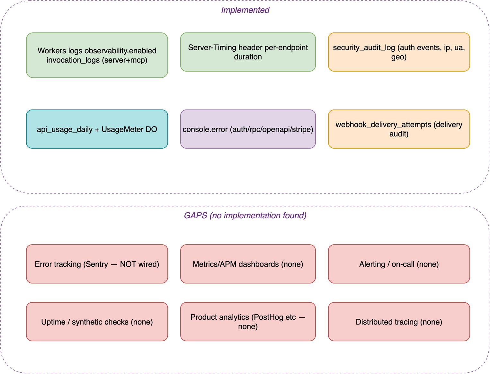

```mermaid
flowchart TB
  subgraph Implemented
    wl[Workers logs<br/>invocation_logs · server+mcp]:::be
    st[Server-Timing per endpoint]:::be
    audit[security_audit_log]:::db
    usage[api_usage_daily + UsageMeter DO]:::q
    console[console.error auth/rpc/openapi/stripe]:::in
    whatt[webhook_delivery_attempts]:::db
  end
  subgraph GAPS[GAPS — not found in repo]
    err[Error tracking · Sentry NOT wired]:::ext
    metrics[Metrics/APM dashboards]:::ext
    alert[Alerting / on-call]:::ext
    uptime[Uptime / synthetic checks]:::ext
    analytics[Product analytics]:::ext
    trace[Distributed tracing]:::ext
  end
  classDef be fill:#D5E8D4,stroke:#82B366; classDef db fill:#FFE6CC,stroke:#D79B00; classDef q fill:#B0E3E6,stroke:#0E8088; classDef in fill:#E1D5E7,stroke:#9673A6; classDef ext fill:#F8CECC,stroke:#B85450;
```

**What exists:** Cloudflare Workers observability is enabled on server (head sampling 1.0, invocation logs) and mcp; per-request `Server-Timing`; structured `console.error` on each handler class; durable audit trails for auth and webhook delivery; first-class usage metering.

**Gaps (flagged — a Sentry MCP is configured in tooling but no Sentry SDK import was found in app code):** no error aggregation/alerting, no APM/metrics dashboards, no uptime/synthetic monitoring, no product analytics, no distributed tracing across the web→server→OSRM/Neon hops. Operational visibility today is **log-grep only**. **Recommendations:** wire Sentry (or Workers Analytics Engine) for errors + release health; add uptime checks on the three domains; emit business metrics (usage, 402 rate, webhook failure rate) to a dashboard; alert on cron failure (currently only `console.error`). **Priority: HIGH** (this is the weakest pillar).

---

## 9. CI/CD & Deployment Pipeline

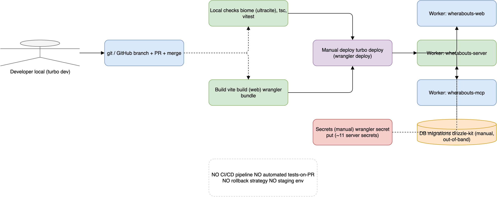

```mermaid
flowchart LR
  dev([Developer · turbo dev]):::u --> git[git / GitHub<br/>branch · PR · merge]:::fe
  git -.local only.-> checks[biome ultracite · tsc · vitest]:::be
  git -.local only.-> build[vite build · wrangler bundle]:::be
  checks & build --> deploy[Manual deploy<br/>turbo deploy = wrangler deploy]:::in
  deploy --> cfweb[locnative-web]:::fe
  deploy --> cfapi[locnative-server]:::be
  deploy --> cfmcp[locnative-mcp]:::fe
  secrets[Secrets manual<br/>wrangler secret put · ~11 server secrets]:::ext -.-> cfapi
  migr[(DB migrations<br/>drizzle-kit · manual)]:::db -.-> cfapi
  gap[NO CI/CD · NO tests-on-PR<br/>NO rollback · NO staging]:::note
  classDef u fill:#F5F5F5,stroke:#666; classDef fe fill:#DAE8FC,stroke:#6C8EBF; classDef be fill:#D5E8D4,stroke:#82B366; classDef in fill:#E1D5E7,stroke:#9673A6; classDef ext fill:#F8CECC,stroke:#B85450; classDef db fill:#FFE6CC,stroke:#D79B00; classDef note fill:#fff,stroke:#ccc,stroke-dasharray:4;
```

**Confirmed: `.github/workflows` does not exist.** Deployment is entirely manual: `pnpm deploy` → `turbo -F web deploy -F server deploy` → `wrangler deploy` (web does `vite build` first). Secrets are set by hand via `wrangler secret put` (~11 server secrets; project history records prod outages from missing secrets and from deploying code that ran ahead of `master`). Migrations are run manually with drizzle-kit, with a documented history of journal/numbering collisions on merges.

**Risks (CRITICAL):** No automated tests gate merges; no staging environment; **no rollback strategy** beyond redeploying an older commit; deploy/secret/migration drift has already caused multiple incidents (prod running un-merged local code; missing secrets throwing on boot). **Recommendations:** add GitHub Actions to run biome+tsc+vitest on PR and `wrangler deploy` on merge to `master`; introduce a staging environment per Worker; manage secrets via `wrangler` in CI from a vault; gate migrations behind a reviewed CI step. **Priority: CRITICAL**.

---

## 10. Dependency Graph & Architectural Risk

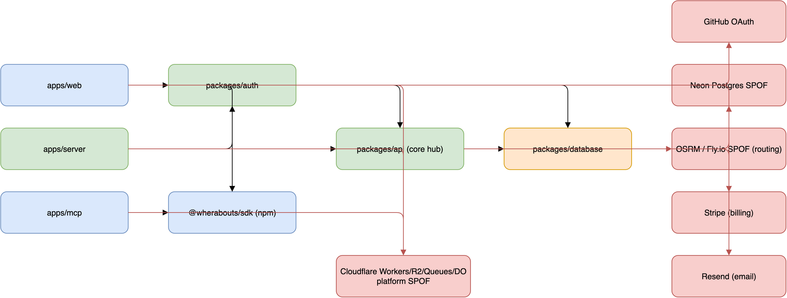

```mermaid
flowchart LR
  web[apps/web]:::fe --> api[packages/api · core hub]:::be
  web --> auth[packages/auth]:::be
  web --> sdk[@locnative/sdk]:::fe
  server[apps/server] --> api
  server --> auth
  mcp[apps/mcp] --> sdk
  api --> db[packages/database]:::db
  auth --> db
  db --> neon[Neon Postgres · SPOF]:::ext
  api --> osrm[OSRM/Fly.io · SPOF AU-only]:::ext
  api --> stripe[Stripe]:::ext
  auth --> resend[Resend]:::ext
  auth --> gh[GitHub OAuth]:::ext
  server --> cf[Cloudflare platform · SPOF]:::ext
  web --> cf
  mcp --> cf
  classDef fe fill:#DAE8FC,stroke:#6C8EBF; classDef be fill:#D5E8D4,stroke:#82B366; classDef db fill:#FFE6CC,stroke:#D79B00; classDef ext fill:#F8CECC,stroke:#B85450;
  linkStyle 9,10,11,12,13,14,15,16 stroke:#B85450,stroke-width:2px;
```

**Internal coupling:** `packages/api` → `packages/database` is the spine; every app funnels through `api`. Healthy direction (apps depend on packages, never the reverse) but `api` is a **tight hub**. **External single points of failure (red):** Cloudflare platform (entire runtime + R2 + Queues + DO), **Neon Postgres** (system of record, no replica seen), **OSRM** (routing; single Fly machine, AU graph only → routing unavailable for non-AU and on host loss), Stripe (billing), Resend (email), GitHub (only OAuth provider).

**Recommendations:** add Neon read replica / PITR posture doc; make OSRM redundant (≥2 machines or a managed routing fallback) and document its non-AU coverage gap; degrade gracefully when Resend/Stripe are down (queue emails, tolerate webhook retry). **Priority: HIGH**.

---

## Gap Analysis Summary

| Area | Severity | Finding | Recommendation |
|---|---|---|---|
| CI/CD | **Critical** | No pipeline, tests, staging, or rollback; manual deploy/secret/migration drift caused prior incidents | GitHub Actions (test on PR, deploy on merge), staging per Worker, secret + migration gates |
| Observability | **High** | No error tracking/alerting/APM/uptime; log-grep only | Wire Sentry/Analytics Engine, uptime checks, cron-failure + 402-rate + webhook-failure alerts |
| Routing SPOF | **High** | OSRM single Fly machine, AU-only (flagged, not in repo) | Redundant OSRM or managed fallback; document coverage |
| Edge security | **High** | No WAF/edge rate-limit on `/api/v1/*`; explorer-test path reuses `BETTER_AUTH_SECRET` | Cloudflare WAF + rate rules; dedicated scoped secret |
| Data integrity | **Medium** | `projects.userId`/`api_keys.userId` are unconstrained `text` (no FK to users) | Add FKs or documented cleanup job; verify `addresses.search_text` index |
| API duplication | **Medium** | `public/` and `domains/` routers duplicate geocode/zones/webhooks → drift risk | Share handler cores; contract-test OpenAPI |
| api hub coupling | **Medium** | `packages/api` concentrates billing+geo+routing+webhooks | Split into core + domain packages as it grows |
| Usage table growth | **Low–Med** | `api_usage_daily` unpartitioned | Monthly partition + retention |

**Over-engineered / strong areas (keep):** exact-concurrency usage metering via per-account Durable Object with Postgres fallback; PostGIS geography expression index; constant-time secret compare; dual-CORS policy; typed env validation; reveal-once encrypted API keys; per-route auth rate limits.

---

## Executive Summary — Maturity Scores

| Dimension | Score | Rationale |
|---|:---:|---|
| **Architecture maturity** | **7 / 10** | Clean monorepo, edge-native, typed end-to-end (oRPC + Drizzle + zod), thin apps over a shared core. Held back by the `api` god-package and public/domain router duplication. |
| **Scalability** | **6 / 10** | Workers + R2 + Queues + DO scale horizontally and usage metering is concurrency-safe. Capped by single-primary Neon and a single AU-only OSRM; PostGIS-heavy reads on one DB. |
| **Security** | **7 / 10** | 2FA, granular rate limits, hashed API keys, audit log, constant-time compare, correct cross-site cookies. Gaps: no edge WAF, shared-secret explorer path, single OAuth provider, in-app rate-limit durability unverified. |
| **Maintainability** | **7 / 10** | Strong typing, Biome/Ultracite, real vitest coverage, documented decisions. Manual ops and migration-collision history drag it down. |
| **Operational readiness** | **4 / 10** | Logs + Server-Timing + audit exist, but **no error tracking, alerting, uptime, staging, or CI/CD**. Weakest pillar. |
| **Production readiness** | **6 / 10** | Live and serving real traffic with thoughtful runtime engineering, but operational/HA gaps and SPOFs make incidents likely and recovery manual. |

**Top 3 priorities:** ① Stand up CI/CD + staging + rollback (Critical). ② Wire error tracking + alerting + uptime (High). ③ Remove routing SPOF and add edge WAF/rate-limiting (High).

> **Explicitly flagged as un-verifiable from the repo:** OSRM hosting/coverage topology; Neon region/replica setup; whether BetterAuth's in-app rate limiter is backed by durable storage at the edge; presence of an `addresses.search_text` prefix index in applied migrations; live prod deploy SHA vs `master`. These should be confirmed against the running infrastructure, not inferred.
